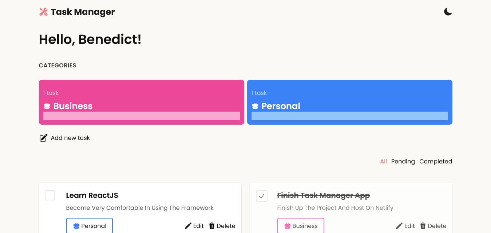
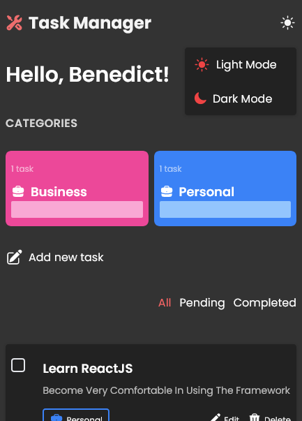

## Task Manager App with color theme switcher 

 A sleek and efficient task manager app built with React. Stay organized, track your tasks, and boost your productivity. Let's get things done!

## Table of contents

- [Project Setup](#project-setup)
- [Overview](#overview)
  - [Screenshot](#screenshot)
  - [Links](#links)
- [My process](#my-process)
  - [Built with](#built-with)
- [Author](#author)

## Project setup

```
npm install
```

### Compiles and hot-reloads for development

```
npm run dev
```

### Compiles and minifies for production

```
npm run build
```


## Overview

Users should be able to:

- Toggle between light and dark mode for a personalized visual experience.
- Set tasks for business or personal reasons, keeping all responsibilities in one place.
- Filter through completed and pending tasks to track progress effectively.
- Easily edit and delete tasks for seamless task management.

### Screenshots

Desktop



Mobile




### Links

- Live Site URL: [See it live](https://taskmanager-web.netlify.app/)

## My process

### Built with

- TailwindCSS
- React Toastify
- Heroicons
- Mobile-first workflow
- [React](https://reactjs.org/) - JS library


## Author

- Twitter - [@dev_benedict](https://www.twitter.com/dev_benedict)
- LinkedIn - [Benedict Umeozor](https://www.linkedin.com/in/benedict-umeozor-014b70228)

